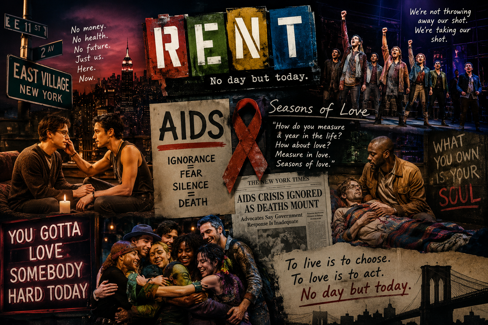

---

# Rent

The musical *Rent* (1996) is a production that brings Giacomo Puccini's unique La Bohème to modern New York. It depicts the lives of young artists in New York's East Village who transform love, suffering, and death caused by HIV/AIDS. Like Angel's battle during the action, the body acts as a key element that enables relationships and life beyond the unique setting. This work strives to vividly bring together the collaborative influence of bohemian counterculture and AIDS politics to 뮤지컬 Rent(1996)는 푸치니의 오페라 La Bohème를 현대 뉴욕으로 재해석한 작품이다. 이스트빌리지 젊은 예술가들의 사랑, 가난, 그리고 HIV/AIDS로 인한 죽음과 상실을 다룬다. 극 중 에이즈(AIDS)는 단순한 설정을 넘어 인물들의 관계를 변화시키는 핵심 서사이자, 20세기 후반 반문화와 질병의 파괴적 영향을 기록한 역사적 연대기이기도 하다. 조나단 라슨은 클래식한 뮤지컬 문법을 깨고 강렬한 일렉트릭 기타와 드럼 비트의 '록 오페라' 형식을 도입하여, 시급한 죽음에 직면한 청년 세대의 분노와 에너지를 날것 그대로 무대에 올렸다. 이러한 질병 서사는 OST의 음악적 장치로 구체화된다. 작품 속 AIDS와 죽음의 공포는 날카로운 록 사운드, 신경질적인 기타 리프, 의도적인 불협화음의 긴장감을 통해 청각적으로 재현된다. 미미와 로저의 갈등을 담은 곡 등에서 거친 드럼 비트는 질병이 신체를 갉아먹는 고통과 시시각각 다가오는 죽음의 압박을 생생히 전달한다. 반면, 질병을 극복하는 공동체의 연대는 따뜻한 가스펠과 소울(Soul)풍의 합창으로 대비된다. 그 정점인 **'Seasons of Love'**는 화려한 악기를 배제하고 담백한 피아노 반주 위에 가스펠 콰이어를 쌓아 올리는 미니멀한 구조를 취한다. 후반부 솔로의 폭발적인 소울 보컬과 정교한 화성은 죽음의 불안 속에서도 담담히 희망을 노래하는 인물들의 연대를 형상화한다. 1년의 시간을 질병의 고통이 아닌 '사랑'으로 측정하겠다는 이 선언은, 절망을 연대의 찬사로 변화시키며 작품의 의료인문학적 의미를 깊이 있게 완성한다.as the ancestral spirit of a fellow believer who loves faith. (https://youtu.be/C4xzYZu_8kc?si=m3497Cf3mQfDCZmo)

# 렌트

뮤지컬 Rent(1996)는 자코모 푸치니의 오페라 La Bohème를 현대 뉴욕으로 재해석한 작품이다. 뉴욕 이스트빌리지의 젊은 예술가들이 겪는 사랑, 가난, 그리고 HIV/AIDS로 인한 죽음과 상실을 다룬다. 극 중 에인절의 죽음처럼 질병은 단순한 설정을 넘어 인물들의 관계와 삶을 변화시키는 핵심 요소로 작용한다. 나아가 이 작품은 20세기 후반 보헤미안 반문화와 AIDS 유행이 예술계에 미친 파괴적 영향을 생생하게 기록한 역사적 연대기이기도 하다. 조나단 라슨은 다채로운 록 음악을 통해 조기 사망에 직면한 세대의 시급하고 활기찬 에너지를 포착했다. 특히 클래식한 오케스트라 중심의 전통 뮤지컬 문법을 깨고 강렬한 일렉트릭 기타와 드럼 비트의 '록 오페라' 형식을 도입했는데, 이는 청년 세대의 분노와 저항을 날것 그대로 무대에 올리며 브로드웨이를 현대 대중음악 뮤지컬 중심으로 근본적으로 바꾸어 놓았다. 이러한 질병 서사와 복잡한 감정은 OST의 음악적 장치로 구체화된다. AIDS와 죽음의 공포는 날카로운 록 사운드와 불협화음의 긴장감으로 표현되는 반면, 이를 극복하는 공동체의 연대는 따뜻한 가스펠과 소울(Soul)풍의 풍성한 합창으로 대비된다. 이 음악적 대비의 정점인 "Seasons of Love"에서 인물들은 죽음의 불안 속에서도 담담히 희망을 노래한다. 1년의 시간을 질병의 고통이 아닌 오직 '사랑'으로만 측정하겠다는 이 선언은, 절망을 사랑과 연대의 찬사로 변화시키며 작품의 의료인문학적 의미를 깊이 있게 완성한다.이와 관련해서 [질병(선행성 기억상실증)으로 매일 기억이 리셋되는 비극적 상실감을 OST 주제곡 '좌우맹'의 가사와 분위기를 통해 구체화하여 전달한다는 내용]()(https://youtu.be/C4xzYZu_8kc?si=m3497Cf3mQfDCZmo)
